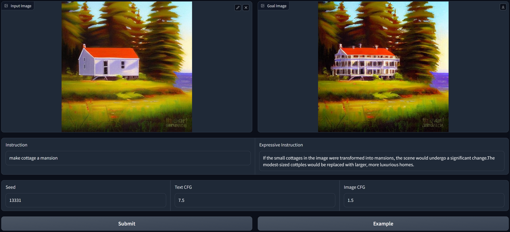

## 🔥 Apple's official repo is open-sourced at [ml-mgie](https://github.com/apple/ml-mgie)

# [ICLR'24] Guiding Instruction-based Image Editing via Multimodal Large Language Models

A **Gradio demo** of [MGIE](https://tsujuifu.github.io/pubs/iclr24_mgie.pdf)

[Paper](https://tsujuifu.github.io/pubs/iclr24_mgie.pdf) | [Project](https://mllm-ie.github.io) | [Demo](https://huggingface.co/spaces/tsujuifu/ml-mgie)


## Gradio Demo
Follow [Requirements](https://github.com/apple/ml-mgie?tab=readme-ov-file#requirements) to build env and put [app.py](https://github.com/tsujuifu/pytorch_mgie/blob/main/app.py) in ml-mgie

Put official [LLaVA-7B](https://drive.google.com/uc?id=1f_zD8UWRNsPV5ztrCmhxEC4o3cD0_zn7) in [_ckpt/LLaVA-7B-v1](_ckpt) and download pre-trained [ckpt](https://docs-assets.developer.apple.com/ml-research/models/mgie/mgie_7b.tar.gz) (on IPr2Pr + MagicBrush) in [_ckpt/mgie_7b](_ckpt)
```
gradio app.py
```

